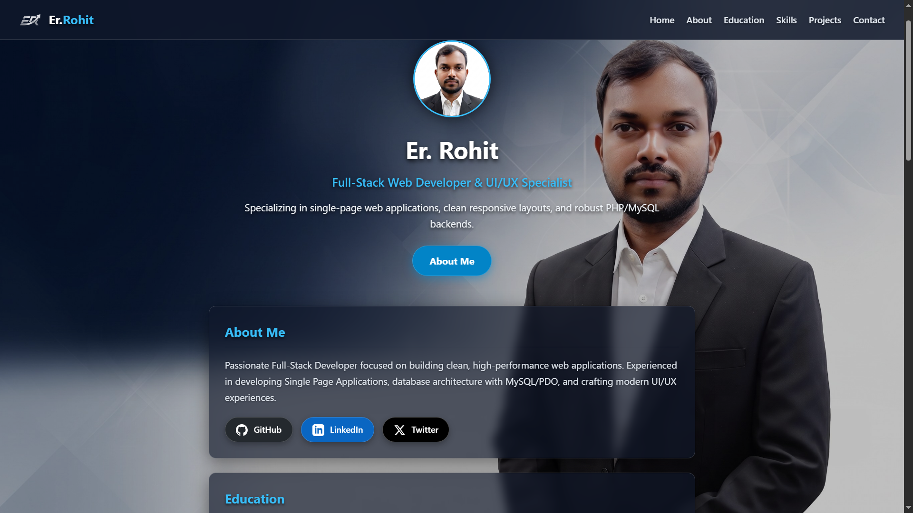

# 🌐 Single Page Application (SPA) - Portfolio & Resume

A responsive, high-performance developer portfolio built as a Single Page Application (SPA). The frontend dynamically fetches profile data, project archives, and educational qualifications via an asynchronous PHP backend API.

---

## 🔗 Live Demo
👉 **[View Live Website](https://er-rohit.freedev.app/)** 

---

## 📸 Website Preview

---

## 🛠️ Tech Stack
* **Frontend:** HTML5, CSS3 (Glassmorphism & Flexbox/Grid), JavaScript (ES6+, Fetch API)
* **Backend:** PHP (RESTful JSON API & server-side validation)
* **Storage:** Persistent message logging (`messages.txt`)

---

## ✨ Features
* **SPA Architecture:** Smooth client-side interactions without full page reloads.
* **PHP-Powered API:** Serves dynamic content (skills, projects, education) asynchronously.
* **Responsive Glassmorphism UI:** Clear HD background image styling with custom social badge stickers.
* **Interactive Contact Module:** Form data sent via AJAX to PHP with server-side validation.
